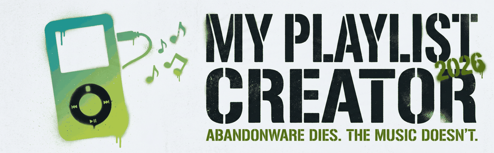
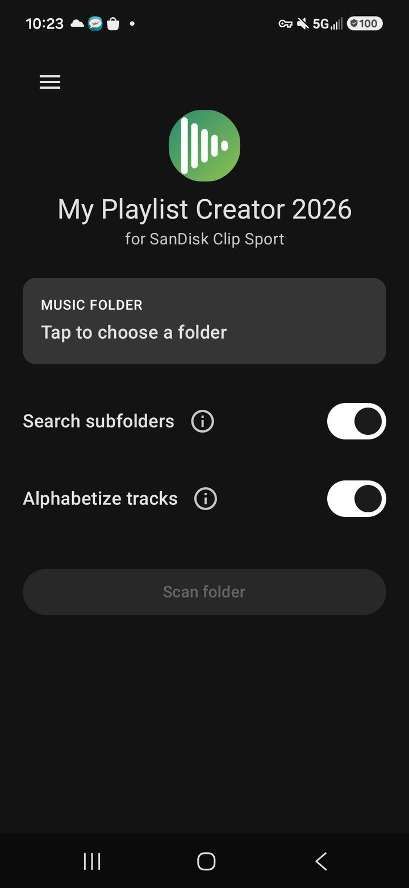
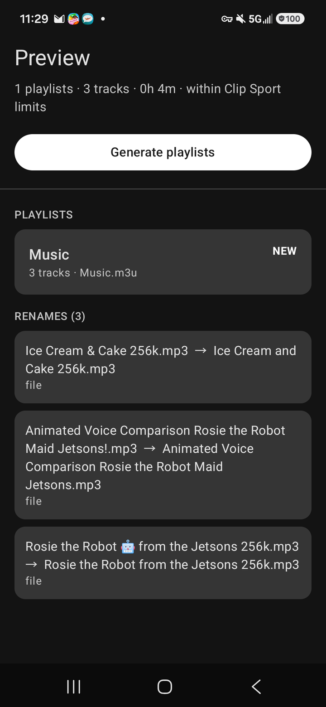
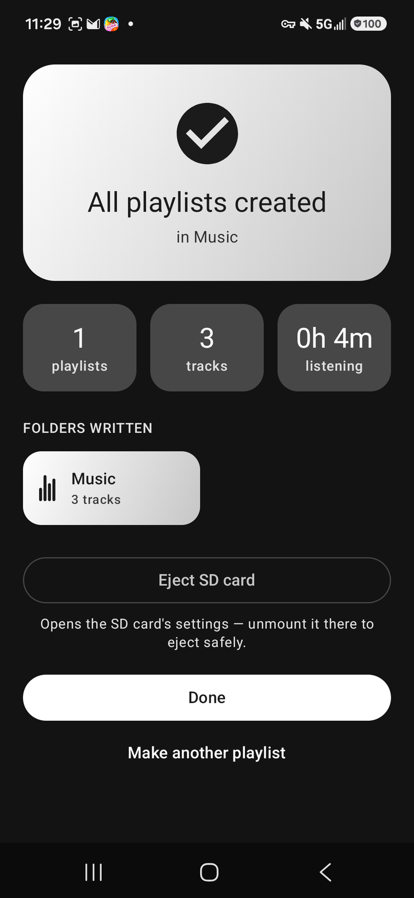

<picture>
  <source media="(prefers-color-scheme: dark)" srcset="docs/readme-assets/hero-dark.png">
  
</picture>

  <b>Byte-perfect <code>.m3u</code> playlists for the SanDisk Clip Sport — one tap, one playlist per folder.</b>

  
  
  

<!-- SCREENSHOTS: activate when docs/screenshots/{home,preview,results}.png land.
     Uncomment the table below as-is. Keep widths equal; captions stay <b>.

<table align="center">
  <tr>
    <td align="center"></td>
    <td align="center"></td>
    <td align="center"></td>
  </tr>
  <tr>
    <td align="center"><b>Home</b></td>
    <td align="center"><b>Preview</b></td>
    <td align="center"><b>Results</b></td>
  </tr>
</table>
-->

· · ·

## Why this exists

For a decade, Clip Sport owners leaned on one tool: *My Playlist Creator* by **Matt Duss** (listed as *My Music Playlist Creator*, `com.matt.mym3ucreator`). It wrote the `.m3u` files the player actually understands. Then it was abandoned, then delisted — the format kept working, but the tool was gone.

**My Playlist Creator 2026** (repo codename *ClipList*) is the from-scratch, open-source revival: the same byte-exact playlist format, verified against golden fixtures on every build, inside a modern Material 3 app. It is not affiliated with or endorsed by Matt Duss or SanDisk — it exists so this little corner of the music world keeps playing. And because it's GPLv3, it can never be abandoned the way its predecessor was.

## Features

- 📁 **One playlist per folder** — scans your SD card and writes `<Folder>.m3u` beside the music
- 🔤 **Clean file names** — optional plain-ASCII renaming the Clip Sport can digest (`Rock & Roll!.mp3` → `Rock and Roll.mp3`), with full preview and nothing ever deleted
- 👀 **Preview before writing** — every playlist, rename, and warning shown up front
- 🕒 **Real durations** — read from each track's metadata; unreadable files are skipped, never deleted
- 🖼️ **Cover art** — optional `folder.jpg` for players that show artwork
- ⏏️ **Safe eject** — deep link straight to the volume's Unmount page
- 🌍 **10 languages** — English, Español, Français, Deutsch, Português (Brasil), Italiano, Русский, 日本語, 한국어, 简体中文
- 🔒 **Zero internet permission** — your music never leaves the card

## The format, frozen

The Clip Sport's `.m3u` dialect — line endings, ordering, naming — is frozen in [`reference/FORMAT.md`](reference/FORMAT.md) and enforced by golden-fixture tests in `:core-format` on every CI run.

> **Not close. Identical.** Output is byte-for-byte identical to the original app's — checked in CI, every build.

## Get it

APKs ship on [Releases](https://github.com/Joeputin100/cliplist/releases) with every tagged version; a Play Store release is planned. Every build is produced by [GitHub Actions](.github/workflows/build.yml) and tested on-device via Firebase Test Lab.

## License

[GPLv3](LICENSE) — free software: use it, learn from it, improve it; improvements stay free.

<b>ABANDONWARE DIES. THE MUSIC DOESN'T.</b>

